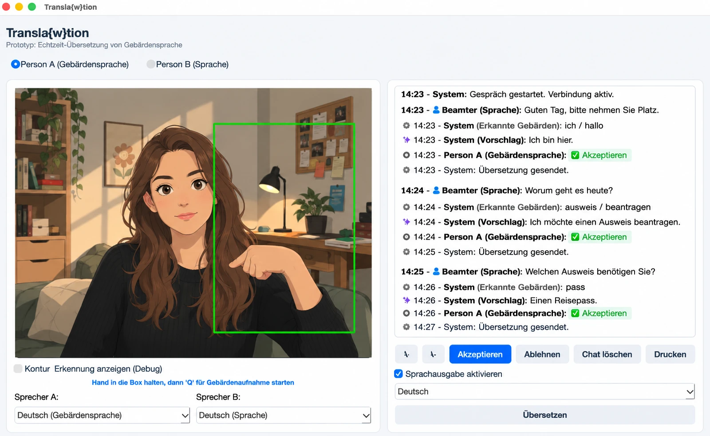

# Transla{w}tion



**Echtzeit-Übersetzung von Gebärdensprache für Behördengänge**

Transla{w}tion ist ein Prototyp für eine Software, die Menschen mit Gebärdensprache bei Behördengängen unterstützen soll. Ziel der Idee ist es, die Kommunikation zwischen gebärdensprachlichen und lautsprachlichen Personen direkt über einen Laptop zu ermöglichen und dadurch in geeigneten Situationen die Abhängigkeit von einem zusätzlichen Dolmetscher zu reduzieren.

Die App soll dabei eine Alternative zur ausschließlich textbasierten Kommunikation für Gebärdensprachler darstellen. Sie sollen nicht nur über E-Mail oder mit Unterstützung eines Dolmetschers kommunizieren können, sondern auch selbstständig und direkt ein Gespräch mit ihrem Gegenüber führen können.

> **Hinweis:** Transla{w}tion ist ein Hackathon-Prototyp und kein fertiges oder für den produktiven Einsatz freigegebenes Übersetzungssystem.

## Entstehung

Die App ist im Rahmen des **Bucerius Law School Hackathon 2025** im **Mai 2025** entstanden.

Der Prototyp wurde entwickelt, um eine mögliche technische Lösung für barriereärmere Kommunikation im Kontext von Behörden zu zeigen. Dabei stand insbesondere die Idee im Vordergrund, Gebärdensprachkommunikation und normale Sprache in einem gemeinsamen Gesprächsfenster zusammenzuführen.

## Versionen und Systemvoraussetzungen

Im Repository befinden sich zwei Windows-Varianten:

- **Windows mit MediaPipe:** Version mit MediaPipe zur Unterstützung der Gebärdenerkennung. Diese Variante funktioniert **nur mit Python 3.11** (Stand: **09.08.2026**).
- **Windows und macOS ohne MediaPipe:** Eine Variante ohne MediaPipe, die sowohl unter **Windows als auch macOS** verwendet werden kann.

Die MediaPipe-Version ist damit insbesondere hinsichtlich der Python-Version eingeschränkt. Die Angaben entsprechen dem Stand des Projekts vom **09.08.2026**.

## Funktionsweise

Das grundlegende Konzept besteht aus zwei Kommunikationswegen:

- **Gebärdensprache → Text:** Eine Kamera erfasst die gebärdende Person. Einzelne erkannte Gebärden werden fortlaufend als Wörter angezeigt.
- **KI-Vorschlag:** Aus den fortlaufend erkannten Wörtern wird im Hintergrund ein sinnvoller deutscher Satz vorgeschlagen.
- **Bestätigung durch die gebärdende Person:** Der vorgeschlagene Satz kann angenommen oder abgelehnt werden. So soll die gebärdende Person kontrollieren können, ob die Software ihre Aussage richtig verstanden und formuliert hat.
- **Normale Sprache → Gespräch:** Eine lautsprachlich kommunizierende Person kann im selben Chat antworten. Dadurch soll ein gemeinsames Gespräch zwischen gebärdensprachlichen und lautsprachlichen Personen möglich werden.
- **Sprachausgabe:** Übersetzte bzw. bestätigte Inhalte können zusätzlich über eine Sprachausgabe ausgegeben werden.

Vereinfacht lässt sich der Ablauf so darstellen:

```text
Gebärde
   ↓
Kamera / Erkennung
   ↓
fortlaufend erkannte Wörter
   ↓
KI formuliert Satzvorschlag
   ↓
Person bestätigt oder lehnt ab
   ↓
gemeinsamer Chat
   ↕
lautsprachliche Antwort
```

Die Oberfläche ist dabei bewusst als einfache Desktop-Anwendung konzipiert. Sie soll grundsätzlich auf einem gewöhnlichen Laptop mit Kamera eingesetzt werden können.

## Beispiel für einen Gesprächsablauf

Ein möglicher Behördengang könnte beispielsweise so aussehen:

```text
10:15 – Person B (Sprache): Guten Tag, wie kann ich Ihnen helfen?

10:15 – System (Erkannt): ich | möchte | einen | ausweis | beantragen

10:15 – System (Vorschlag): Ich möchte einen Ausweis beantragen.

10:15 – Person A (Gebärdensprache): ✓ Übernehmen

10:15 – System: Übersetzung gesendet.

10:16 – Person B (Sprache): Gerne. Benötigen Sie einen Personalausweis oder einen Reisepass?

10:16 – System (Erkannt): personalausweis

10:16 – System (Vorschlag): Ich möchte einen Personalausweis beantragen.

10:16 – Person A (Gebärdensprache): ✓ Übernehmen

10:16 – System: Übersetzung gesendet.

10:17 – Person B (Sprache): Dafür benötige ich bitte Ihren bisherigen Ausweis
und gegebenenfalls ein aktuelles biometrisches Passfoto.
```

Der entscheidende Punkt ist dabei, dass **die erkannte Wortfolge nicht automatisch als endgültige Aussage versendet werden muss**. Erst der Satzvorschlag der KI kann von der gebärdenden Person bestätigt oder abgelehnt werden.

## Status des Projekts

Die App wurde als Hackathon-Prototyp entwickelt und **nicht weiterentwickelt**.

Eine Weiterentwicklung ist **aktuell ebenfalls nicht geplant**. Es bestehen derzeit **keine Pläne**, das Projekt zu einem produktiven oder dauerhaft gepflegten System auszubauen.

Der hier veröffentlichte Stand dient daher in erster Linie als Dokumentation und als Einblick in die im Hackathon entwickelte Idee und den entstandenen Prototyp.

## Wichtige Einschränkungen

Der Prototyp ist **nicht als verlässliches Übersetzungs- oder Kommunikationssystem für reale Behördengänge gedacht**. Insbesondere können automatische Gebärdenspracherkennung und KI-basierte Sprachformulierung Fehler machen.

Bei einer tatsächlichen Anwendung in rechtlich oder administrativ relevanten Situationen müssten unter anderem Genauigkeit, Datenschutz, Barrierefreiheit, Sicherheit, Einwilligung, Haftungsfragen und die zuverlässige Kommunikation mitgedacht und umfangreich geprüft werden.

Die im Prototyp dargestellte Idee ist daher als technisches Konzept und nicht als Ersatz für professionelle Gebärdensprachdolmetschung oder andere notwendige Kommunikationshilfen zu verstehen.

## Kontakt

Bei Interesse am Projekt, dem Prototyp oder der dahinterstehenden Idee kann Kontakt aufgenommen werden:

**legaltechde@mail.de**

---

*Entstanden beim Bucerius Law School Hackathon 2025 · Mai 2025*

---
## Technische Beschreibung

### Übersicht
**Transla{w}tion** ist eine **Python-basierte Desktop-Anwendung**, die **Echtzeit-Gebärdensprachenerkennung** mit **Spracherkennung** und **KI-gestützter Satzgenerierung** kombiniert, um die Kommunikation zwischen gebärdensprachlichen und lautsprachlichen Personen zu erleichtern. Die Anwendung nutzt **MediaPipe** für die Erkennung von Hand-, Gesichts- und Körperhaltungen sowie **Ollama** für die KI-basierte Verarbeitung der erkannten Wörter zu sinnvollen Sätzen.

---

### Architektur
Die Anwendung folgt einem **modularen Aufbau** mit den folgenden Hauptkomponenten:

1. **Benutzeroberfläche (GUI)**
   - Implementiert mit **PyQt5** für eine plattformunabhängige Desktop-Anwendung.
   - Enthält:
     - Ein **Kamera-Fenster** zur Anzeige der Live-Aufnahme und Erkennungskeypoints (optional).
     - Ein **Chat-Fenster** zur Anzeige der erkannten Wörter, KI-Vorschläge und bestätigten Nachrichten.
     - **Steuerelemente** für Sprachauswahl, Aufnahme-Start/Stopp, Übersetzungsfunktionen und Druckoptionen.

2. **Gebärdensprachenerkennung**
   - Nutzt **MediaPipe** (`mediapipe.solutions.hands`, `mediapipe.solutions.face_mesh`, `mediapipe.solutions.pose`) zur Erkennung von:
     - **Handgesten** (z. B. Position der Finger für Gebärden wie "Ich", "Tat", "nicht").
     - **Gesichtslandmarken** (z. B. zur Unterstützung der Kontextanalyse).
     - **Körperhaltung** (z. B. zur Erkennung von Bewegungen wie "Hände nach vorne schieben").
   - Die Erkennung läuft in einem **separaten Thread (`VideoThread`)**, um die GUI responsiv zu halten.

3. **Spracherkennung (für lautsprachliche Eingaben)**
   - Nutzt **`speech_recognition`** mit der **Google Speech Recognition API** zur Umwandlung von Audioaufnahmen in Text.
   - Audioaufnahmen werden mit **`sounddevice`** und **`soundfile`** realisiert.
   - Die Verarbeitung läuft in einem **separaten Thread (`AudioRecorder`)**, um Blockaden der GUI zu vermeiden.

4. **KI-gestützte Satzgenerierung**
   - Nutzt **Ollama** (lokal ausgeführtes `gemma3:1b`-Modell) zur:
     - **Korrektur und Zusammenführung** der erkannten Wörter zu grammatikalisch korrekten Sätzen.
     - **Kontextuellen Anpassung** basierend auf vorherigen Nachrichten im Chat.
   - Das Modell wird mit **Prompts** gesteuert, die je nach Sprache (Deutsch/Englisch) angepasst sind.

5. **Übersetzung und Sprachausgabe**
   - **Übersetzung**: Nutzt **`deep_translator`** (GoogleTranslator) zur Übersetzung von Texten in die Zielsprache (Deutsch, Englisch, Französisch, Spanisch).
   - **Sprachausgabe**: Nutzt **`gTTS`** (Google Text-to-Speech) zur Generierung von Sprachausgaben aus Text.
   - Beide Dienste senden Daten an **externe Google-Server** (siehe [Datenschutzhinweise](#datenschutzhinweise)).

6. **Druckfunktion**
   - Nutzt **PyQt5.QtPrintSupport** (`QPrinter`, `QPrintPreviewDialog`) zur Erstellung einer druckbaren Version des Chatverlaufs im **A4-Format**.

---

### Verwendete Bibliotheken und Abhängigkeiten
   **Bibliothek**               | **Version**       | **Zweck**                                                                                     |
 |------------------------------|-------------------|---------------------------------------------------------------------------------------------|
 | **PyQt5**                    | 5.x               | GUI-Framework für die Desktop-Anwendung (Fenster, Buttons, Layouts, etc.).                  |
 | **OpenCV (`cv2`)**           | 4.x               | Bildverarbeitung für die Kameraaufnahme und Anzeige.                                         |
 | **MediaPipe**                | 0.10.x            | Erkennung von Hand-, Gesichts- und Körperlandmarken für die Gebärdensprachenerkennung.      |
 | **NumPy**                    | 1.x               | Mathematische Operationen (z. B. Abstandsberechnungen zwischen Landmarken).                 |
 | **sounddevice**              | 0.4.x             | Audioaufnahme vom Mikrofon.                                                                   |
 | **soundfile**                | 0.12.x            | Speichern und Laden von Audiodateien (z. B. `.wav`).                                         |
 | **speech_recognition**       | 3.10.x            | Umwandlung von Audio in Text (Nutzung der Google Speech Recognition API).                     |
 | **deep_translator**          | 1.11.x            | Übersetzung von Texten in verschiedene Sprachen (Nutzung von Google Translate).           |
 | **gTTS**                     | 2.3.x             | Generierung von Sprachausgaben aus Text (Nutzung von Google Text-to-Speech).               |
 | **Ollama**                   | 0.1.x             | Lokale Ausführung von KI-Modellen (`gemma3:1b`) für die Satzgenerierung.                     |
 | **PyQt5.QtMultimedia**       | 5.x               | Abspielen von Sprachausgaben (z. B. `.mp3`-Dateien).                                         |
 | **PyQt5.QtPrintSupport**     | 5.x               | Druckfunktionalität für den Chatverlauf.                                                     |
 | **threading / queue**        | Standardbibliothek | Parallelisierung von Audio-/Videoaufnahmen und GUI.                                          |
 | **datetime**                 | Standardbibliothek | Zeitstempel für Chat-Nachrichten.                                                             |
 | **tempfile**                 | Standardbibliothek | Erstellung temporärer Dateien (z. B. für Audioaufnahmen).                                    |
 | **platform**                 | Standardbibliothek | Plattformspezifische Anpassungen (z. B. Pfadtrennzeichen).                                   |

---

### Ablauf der Gebärdensprachenerkennung
1. **Kameraaufnahme**:
   - Die Kamera wird mit `cv2.VideoCapture(0)` initialisiert.
   - Jeder Frame wird in **RGB** umgewandelt und an MediaPipe übergeben.

2. **Landmark-Erkennung**:
   - MediaPipe erkennt **Hand-, Gesichts- und Körperlandmarken** in Echtzeit.
   - Die Positionen der Finger (z. B. `THUMB_TIP`, `INDEX_FINGER_TIP`) werden extrahiert.

3. **Gebärdenzuordnung**:
   - Basierend auf den **relativen Positionen der Landmarken** (z. B. Abstand zwischen Daumen und Zeigefinger) werden **vordefinierte Gebärden** erkannt:
     - **Deutsch**: "Ich", "Tat", "nicht", "begangen".
     - **Amerikanisch (ASL)**: "I", "did", "not", "commit".
   - Erkannte Wörter werden in einer Liste (`recognized_words`) gesammelt.

4. **KI-basierte Satzgenerierung**:
   - Die Liste der erkannten Wörter wird an **Ollama (`gemma3:1b`)** gesendet.
   - Das KI-Modell generiert einen **grammatikalisch korrekten Satzvorschlag** und sendet diesen zurück.
   - Der Vorschlag wird im Chat angezeigt und kann von der gebärdenden Person **bestätigt oder abgelehnt** werden.

5. **Chat-Integration**:
   - Bestätigte Sätze werden als Nachricht von **Person A (Gebärdensprache)** im Chat angezeigt.
   - Lautsprachliche Antworten (Person B) werden über die **Spracherkennung** erfasst und ebenfalls im Chat angezeigt.

---

### Ablauf der Spracherkennung (Person B)
1. **Audioaufnahme**:
   - Der Nutzer startet die Aufnahme mit der **Taste "Q"** oder einem Button.
   - Audio wird mit `sounddevice.rec()` für **5 Sekunden** aufgenommen (Sample Rate: 44.1 kHz, 1 Kanal).

2. **Spracherkennung**:
   - Die Audiodatei wird mit `speech_recognition.Recognizer` und der **Google Speech Recognition API** in Text umgewandelt.
   - Die Sprache wird basierend auf der Auswahl im GUI gesetzt (`de-DE` für Deutsch, `en-US` für Englisch).

3. **Anzeige im Chat**:
   - Der erkannten Text wird als Nachricht von **Person B (Sprache)** im Chat angezeigt.

---
---
### Ablauf der Übersetzung und Sprachausgabe
1. **Übersetzung**:
   - Der Nutzer wählt eine **Zielsprache** (Deutsch, Englisch, Französisch, Spanisch) aus.
   - Der aktuelle Text wird mit `GoogleTranslator` übersetzt.

2. **Sprachausgabe**:
   - Der übersetzte Text wird mit `gTTS` in eine **MP3-Datei** umgewandelt.
   - Die Datei wird mit `QMediaPlayer` abgespielt und nach 5 Sekunden gelöscht.

---
---
### Threading-Modell
Um die **Responsivität der GUI** zu gewährleisten, werden zeitintensive Aufgaben in **separaten Threads** ausgeführt:
 | **Thread**          | **Zweck**                                                                                     | **Signale**                                                                                     |
 |---------------------|---------------------------------------------------------------------------------------------|------------------------------------------------------------------------------------------------|
 | **`VideoThread`**   | Verarbeitet Kamera-Frames und erkennt Gebärden.                                             | `change_pixmap_signal` (Bildaktualisierung), `recording_finished_signal` (erkannte Wörter).   |
 | **`AudioRecorder`** | Nimmt Audio auf und wandelt es in Text um.                                                   | `recording_finished_signal` (erkannter Text), `processing_started_signal` (Verarbeitungsstart). |

- **Hauptthread (GUI)**: Verwaltet die Benutzeroberfläche und reagiert auf Nutzerinteraktionen.
- **Kommunikation zwischen Threads**: Erfolg über **PyQt5-Signale** (`pyqtSignal`).

---
---
### Datenfluss
```mermaid
graph TD
    A[Kamera] -->|Video-Frames| B[VideoThread]
    B -->|Landmarken| C[Gebärden-Erkennung]
    C -->|Erkannte Wörter| D[Ollama KI]
    D -->|Satzvorschlag| E[Chat]
    E -->|Bestätigung| F[Sprachausgabe / Übersetzung]

    G[Mikrofon] -->|Audio| H[AudioRecorder]
    H -->|Text| E
    E -->|Text| I[GoogleTranslator]
    I -->|Übersetzung| E
    E -->|Text| J[gTTS]
    J -->|MP3| K[QMediaPlayer]
